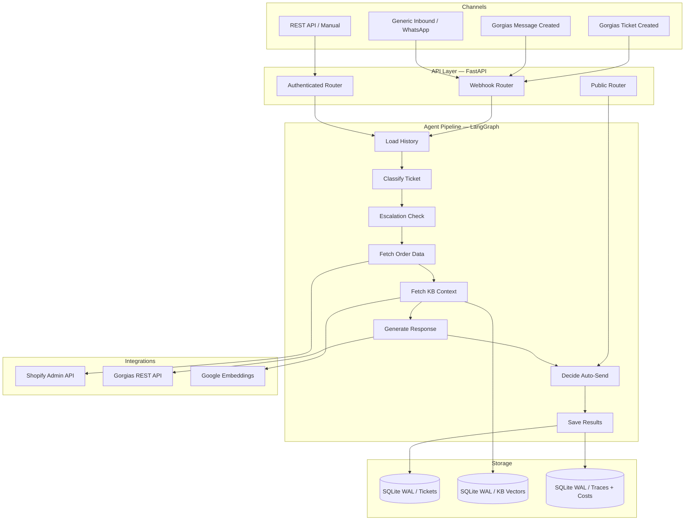
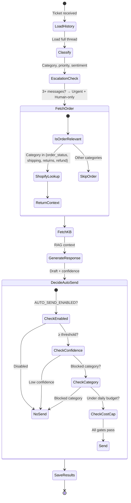
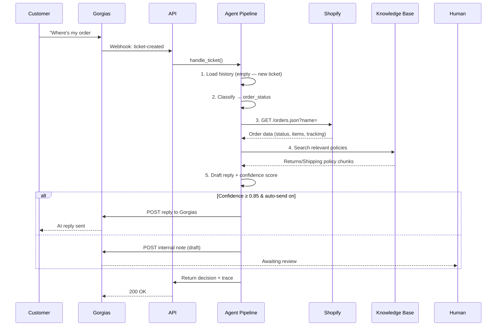

<div align="center">

# Customer Support AI Employee

### Deploy an AI agent into your Shopify store in 10 minutes. It answers orders, handles returns, suggests refunds, and escalates — all inside your Gorgias workflow.

[](LICENSE)
[](https://www.python.org/)
[](https://fastapi.tiangolo.com/)
[](https://langchain-ai.github.io/langgraph/)
[](https://openrouter.ai/)
[](https://react.dev/)
[](https://www.sqlite.org/)
[](https://github.com/Ismail-2001/AI-support-operations-platform-for-Shopify-stores/actions)
[](https://render.com/)
[](https://shopify.com/)

---

[Key Features](#key-features) •
[Architecture](#architecture) •
[Quick Start](#quick-start) •
[API Reference](#api-reference) •
[Safety Proof](sales/SAFETY_PROOF.md) •
[Security](#security-model) •
[Deployment](#deployment) •
[Testing](#testing--evaluation) •
[Contributing](#contributing)

</div>

---

## The Problem

Every ecommerce brand with a Shopify store answers the same questions every day:

> *"Where's my order?"* — *"Can I return this?"* — *"When will it ship?"* — *"I never received item X."*

Your support team spends **60-70% of their time** on order-status lookups, return requests, and shipping questions. The repetitive ones drain morale. The complex ones get rushed. Customers wait hours for answers an AI could give in seconds.

Existing chatbot solutions fail because they **don't have access to your actual order data** — they're generic LLMs with a script, not agents connected to your store.

## The Solution

**cs-agent** is a purpose-built AI support agent that lives inside your Shopify + Gorgias stack. It's not a chatbot — it's an **autonomous employee** that:

- **Reads the full conversation thread** before answering (not just the last message)
- **Looks up real Shopify order data** — status, tracking, items, fulfillment
- **Grounds replies in your policies** via RAG knowledge base
- **Knows when to escalate** — 3rd follow-up = auto-escalate to urgent, human-only
- **Suggests refunds, cancellations, and address edits — but NEVER executes them** — human-in-the-loop always
- **Tracks its own accuracy** — compares AI drafts vs what humans actually send

> **"Set a junior support rep free for the price of a coffee. Deploy in 10 minutes, trust it in 2 weeks."**

---

## Key Features

### Conversational Memory

Every ticket is a persisted thread. Follow-up messages re-classify with the **full conversation** as context — not just the latest message. No repeating information. No treating an escalation as a fresh ticket.

*"Still nothing?!" on message 3 reads very differently when the AI has seen messages 1-2.*

### Real Shopify Integration

Connects to your Shopify Admin API to look up real order status, tracking numbers, line items, and fulfillment status. No mock data. No "I don't have access to that information."

Category-aware: only fetches orders when the ticket is order-related (saves API calls).

### RAG Knowledge Base

Zero-infrastructure vector search over your Shopify policies + product catalog + custom FAQ. All embeddings stored locally in SQLite — no Pinecone, no Weaviate, no extra cost.

One-click sync: `POST /support/knowledge-base/sync-shopify` — **incremental**: content hashes skip unchanged products (no re-embedding a 500-item catalog), and live stock levels are queryable per product.

### Safety-First Design

- **Confidence-gated auto-send** — below threshold = internal note for human review
- **Money-moving actions are ALWAYS human-approved** — refunds, resends, cancels, and address edits each require an explicit API call with `Idempotency-Key`
- **Hard-coded blocked categories** — refund/complaint/legal never auto-send, even at 99% confidence
- **Cost cap circuit breaker** — daily LLM spend limit force-disables auto-send
- **PII redaction** — emails and phone numbers masked before LLM calls
- **Webhook body size limit** — 1 MB cap prevents memory exhaustion

> 🛡️ **Proven, not promised:** [sales/SAFETY_PROOF.md](sales/SAFETY_PROOF.md) walks through four real cases from the eval harness — prompt injection forcing a $500 refund, a knowledge-base gap, an angry customer, and an order-status lookup — with the agent's actual outputs. The dataset now spans 23 golden cases (15/15 last full run; 4 new action-suggestion + 4 subscription cases harness-verified).

### Self-Improvement Analytics

Every human-sent reply is diffed against the AI's draft. `/support/analytics/quality` shows edit rate by category — that's your signal for which categories need better prompts or more KB content.

Plus: confidence calibration reporting to verify the model's self-reported confidence is actually trustworthy.

### Full Pipeline Tracing

Every LLM call is logged with exact input (transcript + context), output, latency, tokens, and cost. `/support/tickets/{id}/trace` answers "why did it say that?" — essential for building trust with clients.

### Operator Dashboard

React + TypeScript + Tailwind dashboard for reviewing tickets, tracking analytics, managing the knowledge base, and monitoring cost spend. Dark mode, command palette (`Ctrl+K`), CSV export, customer info panels.

### Storefront Chat Widget

A drop-in `<script src="https://<api>/chat/widget.js" data-key="...">` opens live chat on your storefront. Shadow DOM keeps it isolated from your theme; SSE streaming shows the agent's stages live ("Looking up your order…"); sessions resume for returning visitors. Authenticated by a publishable widget key (rotate anytime), rate-limited per IP, and a one-click **"Talk to a human"** flags the ticket for your team in the dashboard.

### ROI & Impact Dashboard

Every auto-sent reply and reviewed draft is costed against real LLM spend. The ROI page converts hours saved into dollars using your own assumptions (minutes per task, hourly rate) and shows net savings, cost per ticket, and edit rates over any window — the number you show your client when it's time to renew.

### 10-Minute Onboarding Wizard

A guided four-step setup turns a raw store into a working agent: **connect Shopify → import policies & products into the knowledge base → set brand voice (tone, sign-off, support email) → send a live test ticket and review the draft.**

Built for non-technical founders:

- Each step is a **numbered plain-English checklist** with a screenshot slot (drop images into `dashboard/public/screenshots/` and they render automatically).
- **"I need help creating the Shopify app"** — an inline panel covering the three classic stuck-points (custom-app button greyed out, which API scopes, where the one-time token hides), with a slot for a 2-minute Loom walkthrough.
- Every brand-voice field has helper text and a **live sign-off preview** before you save.
- After the test draft: **"This is only a preview. Nothing was sent to any customer."**
- Finish on a **"You're ready"** screen that confirms review mode is active, summarizes what's connected, and gives the three next steps.

The result card shows grounding evidence — which parts came from real Shopify order data vs. the knowledge base — plus a confidence score, before anything ships. Auto-send stays in review mode until you explicitly turn it on.

### Subscription Management (Recharge & Skio)

Pause, skip, cancel, change delivery frequency, or fix a subscription's shipping address — from the ticket itself. The agent reads live subscription state (next charge date, plan, address) through Recharge or Skio, drafts the operation, and a human approves it in one click. Payment-method changes are advice-only (portal link) — card data never touches chat. Same `Idempotency-Key` + audit-trail guarantees as every other action; subscriptions in the wrong state (already cancelled, no next charge to skip) fail with clear 409s.

### Return Labels (ShipEngine)

Returns get a policy eligibility check (refund state, fulfillment, return window, line items) plus a one-click ShipEngine return label: rates are fetched, the cheapest is bought with `is_return_label: true`, and the tracking number + PDF land on the ticket — which moves to `awaiting_customer` and gets tagged in Shopify. Missing ShipEngine or return-address config surfaces an explicit error instead of a silent failure. *Why ShipEngine over EasyPost: a first-class return-label flag on label purchase and rating + buying in one API, isolated behind `integrations/shipengine.py` so another provider can be swapped in without touching the endpoint.*

### Multi-Store / Agency Mode

Requests carrying an `X-Store-Id` header resolve tickets, knowledge, audits, and the agent's Shopify credentials to that store's own database file and registry entry, while `/support/stores` stays a global admin surface (credentials write-only). The dashboard ships a **Stores** page (register stores, attach shop tokens, delete) and a sidebar store switcher — switching remounts the workspace in the new context. No header = default store, so single-store deployments behave exactly as before.

<details>
<summary><b>Competitive Advantages — Why This Beats Generic Chatbots</b></summary>

| Capability | cs-agent | Generic LLM Chatbot | Zendesk AI | Gorgias AI |
|---|---|---|---|---|
| **Real Shopify order lookup** | Native | — | Yes | — |
| **Conversation memory (full thread)** | Always | Usually last message only | Yes | Yes |
| **Auto-send with confidence gating** | Configurable | All-or-nothing | Yes | — |
| **Human-before-money actions** | Hard-coded | Prompt-only | Yes | Yes |
| **Cost cap circuit breaker** | Built-in | — | — | — |
| **Self-improvement analytics** | Edit-rate by category | — | — | — |
| **Prompt injection eval harness** | 23 cases + adversarial | — | — | — |
| **Knowledge base (RAG)** | Local SQLite (zero infra) | — | Yes | — |
| **Open-source / self-hosted** | Full code | SaaS only | — | — |
| **Pricing** | One-time setup + $0/mo | $0-$1000/mo | $55+/mo | $360+/mo |

</details>

---

## Architecture

### System Overview



### Agent Pipeline (LangGraph StateGraph)



### Data Flow — Single Ticket Lifecycle



---

## Tech Stack

| Layer | Technology | Purpose |
|---|---|---|
| **Runtime** | Python 3.12+ | Core application language |
| **API Framework** | FastAPI 0.142 | Async REST + webhook endpoints |
| **LLM Orchestration** | LangGraph 1.2 | State machine for agent pipeline |
| **LLM Provider** | OpenRouter (gpt-4o-mini) | Primary — eval-validated (19-case golden dataset) |
| **LLM Secondary** | Groq (llama-3.3-70b) | Second in chain — re-run evals when switching |
| **LLM Tertiary** | Google Gemini | Third in chain |
| **LLM Fallback** | Claude Haiku | On primary exhaustion (optional, `ANTHROPIC_API_KEY`) |
| **Database** | SQLite + WAL mode | Tickets, KB vectors, traces, costs |
| **Vector Search** | NumPy + SQLite | Local cosine similarity (zero infra) |
| **Embeddings** | Google Gemini | gemini-embedding-001 |
| **Dashboard** | React + TypeScript | Operator UI with dark mode |
| **Styling** | Tailwind CSS | Utility-first CSS |
| **Deployment** | Render / Docker | Blueprint deploy + free tier |
| **Testing** | Pytest + Vitest | 337 Python + 117 frontend tests |
| **Linting** | Ruff | Fast Python linter + formatter |
| **CI/CD** | GitHub Actions | Automated test + lint + deploy pipeline |

---

## Quick Start

### Prerequisites

- Python 3.12+
- Node.js 20+ (for dashboard)
- An [OpenRouter API key](https://openrouter.ai/keys) (eval-validated primary provider)
- A [Google API key](https://aistudio.google.com/apikey) (required for Knowledge Base / RAG)
- A [Shopify store](https://shopify.com) with a custom app that has `read_orders` + `read_products` scopes
- A [Gorgias account](https://gorgias.com) with REST API key *(optional — the agent runs without it via API + dashboard)*

### 1. Clone & Configure

```bash
git clone https://github.com/Ismail-2001/AI-support-operations-platform-for-Shopify-stores.git
cd AI-support-operations-platform-for-Shopify-stores
cp .env.example .env
```

Fill in `.env` with your keys:

```bash
TENANT_NAME=my-store
OPENROUTER_API_KEY=sk-or-your-key-here
OPENROUTER_MODEL=openai/gpt-4o-mini
GOOGLE_API_KEY=your-google-api-key

SHOPIFY_SHOP_DOMAIN=my-store.myshopify.com
SHOPIFY_ACCESS_TOKEN=shpat_your_token_here

GORGIAS_DOMAIN=my-store
GORGIAS_EMAIL=you@yourstore.com
GORGIAS_API_KEY=your_gorgias_api_key

# Generate this: python3 -c "import secrets; print(secrets.token_urlsafe(32))"
API_KEY=your_api_key_here
```

### 2. Install & Run

```bash
# Create virtual environment
python -m venv .venv
.venv\Scripts\activate  # Windows
# source .venv/bin/activate  # macOS/Linux

# Install dependencies
pip install -r requirements.txt

# Start API server
uvicorn api.main:app --reload --port 8001
```

```bash
# In another terminal — start the dashboard
cd dashboard
npm install
npm run dev
```

Or use the convenience command:

```bash
make dev    # Starts both API + dashboard
```

### 3. Verify

```bash
# Health check
curl http://localhost:8001/health

# Authenticated health
curl http://localhost:8001/support/health -H "X-API-Key: your_api_key_here"

# Create a test ticket
curl -X POST http://localhost:8001/support/tickets \
  -H "X-API-Key: your_api_key_here" \
  -H "Content-Type: application/json" \
  -d '{"customer_email":"test@example.com","subject":"Where is my order?","body":"I ordered #1042 last week and it has not arrived."}'
```

Dashboard: **http://localhost:5173**

---

## Configuration

### Core Settings

| Variable | Required | Description |
|---|---|---|
| `TENANT_NAME` | Yes | Deployment label (one per client) |
| `OPENROUTER_API_KEY` | Yes* | Primary LLM provider key (eval-validated) |
| `OPENROUTER_MODEL` | No | Default: `openai/gpt-4o-mini` |
| `GROQ_API_KEY` | No* | Second-choice LLM key (not eval-validated) |
| `GROQ_MODEL` | No | Default: `llama-3.3-70b-versatile` |
| `GOOGLE_API_KEY` | Yes | Chat fallback (Gemini) **and required for Knowledge Base / RAG** — embeddings use `gemini-embedding-001` regardless of chat provider |
| `SHOPIFY_SHOP_DOMAIN` | Yes | Your Shopify store domain |
| `SHOPIFY_ACCESS_TOKEN` | Yes | Admin API token (`read_orders` + `read_products` scopes) |
| `GORGIAS_DOMAIN` | Optional† | Gorgias subdomain |
| `GORGIAS_EMAIL` | Optional† | Gorgias login email |
| `GORGIAS_API_KEY` | Optional† | Gorgias REST API key |
| `API_KEY` | Yes | Auth key for all `/support/*` endpoints |

*At least one chat provider key is required (`OPENROUTER_API_KEY` > `GROQ_API_KEY` > `GOOGLE_API_KEY` — first match wins). `GOOGLE_API_KEY` is additionally required for the Knowledge Base.*

† *Gorgias credentials are only needed for the Gorgias webhook/reply loop. Without them the agent still works end-to-end through the REST API and dashboard (tickets in, drafts out).*

### Integrations (Optional)

| Variable | Required | Description |
|---|---|---|
| `RECHARGE_API_TOKEN` | Optional | Recharge admin REST API token — pause/skip/cancel/address/frequency |
| `SKIO_API_TOKEN` | Optional | Skio GraphQL API token |
| `SUBSCRIPTION_PROVIDER` | No | `auto` (default: Recharge, then Skio) / `recharge` / `skio` |
| `SUBSCRIPTION_PAUSE_DAYS` | No | Recharge has no pause endpoint — pause pushes the next charge out by this many days (default `30`) |
| `SHIPENGINE_API_KEY` | Optional | Return-label rating + purchase (ShipEngine, not EasyPost) |
| `RETURN_WINDOW_DAYS` | No | Policy window used by return eligibility (default `30`) |
| `RETURN_ADDRESS_*` | Optional† | Return origin: `NAME`, `1`, `2`, `CITY`, `STATE`, `ZIP`, `COUNTRY`, `PHONE` |
| `RETURN_PACKAGE_*` | No | Label package dims: `WEIGHT_OZ`, `LENGTH_IN`, `WIDTH_IN`, `HEIGHT_IN` |

† *Without ShipEngine/return-address config, subscription and return endpoints answer honestly (`configured: false` / `RETURN_ADDRESS_MISSING`) instead of failing mid-action.*

### Safety Gates

| Variable | Default | Description |
|---|---|---|
| `AUTO_SEND_ENABLED` | `false` | Start `false` for first 1-2 weeks |
| `AUTO_SEND_MIN_CONFIDENCE` | `0.85` | Minimum confidence to auto-send |
| `AUTO_SEND_BLOCKED_CATEGORIES` | `refund,complaint,legal,other,subscription` | Never auto-sent |
| `DAILY_COST_CAP_USD` | `5.0` | Auto-send disabled when exceeded |
| `AUTO_SEND_MIN_CONFIDENCE_<CATEGORY>` | per-category | Per-category threshold overrides (e.g. `..._RETURNS=0.87`, `..._ORDER_STATUS=0.88`); default `0.90`. Runtime overrides via `PUT /support/automation/thresholds`, floor `0.80` |
| `ACTION_RATE_LIMIT_PER_MINUTE` | `10` | Rate limit on cancel/edit-address action endpoints |

### Security

| Variable | Default | Description |
|---|---|---|
| `REQUIRE_API_KEY` | `true` | Require X-API-Key on all endpoints |
| `ALLOWED_ORIGINS` | `""` | Dashboard domain(s) for CORS |
| `GORGIAS_WEBHOOK_SECRET` | — | Shared secret for Gorgias webhook |
| `INBOUND_WEBHOOK_SECRET` | — | Shared secret for generic inbound |
| `RATE_LIMIT_PER_MINUTE` | `60` | Requests/minute per IP |

---

## API Reference

### Tickets

| Method | Path | Description | Auth |
|---|---|---|---|
| `POST` | `/support/tickets` | Create + fully process a new ticket | API Key |
| `GET` | `/support/tickets` | List tickets (filter by status/category/priority) | API Key |
| `GET` | `/support/tickets/{id}` | Get one ticket + AI suggestion | API Key |
| `PATCH` | `/support/tickets/{id}` | Update status/priority/notes | API Key |
| `POST` | `/support/tickets/{id}/messages` | Add follow-up message (same thread) | API Key |
| `GET` | `/support/tickets/{id}/messages` | View full conversation thread | API Key |
| `GET` | `/support/tickets/{id}/suggestion` | Re-fetch stored AI draft | API Key |
| `GET` | `/support/tickets/{id}/order` | Linked order: line items, shipping address, refundable balance (for approval UI) | API Key |
| `POST` | `/support/tickets/{id}/respond` | Send human (possibly edited) reply | API Key |

### Actions (Human-Approved Only)

| Method | Path | Description |
|---|---|---|
| `POST` | `/support/tickets/{id}/actions/refund` | Execute a real Shopify refund. Requires `Idempotency-Key` header. |
| `POST` | `/support/tickets/{id}/actions/resend-order` | Create a replacement order in Shopify. Requires `Idempotency-Key` header. |
| `POST` | `/support/tickets/{id}/actions/cancel` | Cancel an unfulfilled order (restocks inventory). Requires `Idempotency-Key`. 409 if already fulfilled/cancelled. |
| `POST` | `/support/tickets/{id}/actions/edit-address` | Update shipping address before shipment. Requires `Idempotency-Key`. Audit stores old + new address. |
| `POST` | `/support/tickets/{id}/actions/subscription` | Pause/skip/cancel/update address/change frequency via Recharge or Skio. Requires `Idempotency-Key`. Audited per operation. |
| `GET` | `/support/tickets/{id}/subscriptions` | Normalized subscription list for the ticket's customer (`configured: false` when unconnected) |
| `GET` | `/support/tickets/{id}/return-eligibility` | Return policy check: window, refund state, line items |
| `POST` | `/support/tickets/{id}/actions/return-label` | Buy a ShipEngine return label (cheapest rate). Requires `Idempotency-Key`. |

### Multi-Store Registry

Global admin surface — these endpoints ignore any `X-Store-Id` on the request, and credentials are write-only (responses expose `has_shopify_token`, never the token).

| Method | Path | Description |
|---|---|---|
| `GET` | `/support/stores` | List registered stores |
| `POST` | `/support/stores` | Register a store (`name`, optional `shop_domain`, `shopify_access_token`) — 409 on duplicate domain |
| `GET` | `/support/stores/{id}` | Store detail |
| `PATCH` | `/support/stores/{id}` | Rename / attach or clear the Shopify token (invalidates the cached store context) |
| `DELETE` | `/support/stores/{id}` | Unregister a store (per-store data file is kept on disk — no silent data destruction) |

Any other endpoint called with `X-Store-Id: <id>` operates inside that store's isolated database; an unknown id returns `404 STORE_NOT_FOUND`.

### Setup Wizard

| Method | Path | Description | Auth |
|---|---|---|---|
| `GET` | `/support/setup` | Wizard progress — which steps are done (Shopify, KB chunks, voice, test) | API Key |
| `POST` | `/support/setup/shopify` | Connect Shopify + import policies/products into the KB | API Key |
| `PUT` | `/support/setup/voice` | Save brand voice (store name, tone, sign-off, support email) | API Key |
| `POST` | `/support/setup/test` | Send a live test ticket; returns draft + grounding + confidence | API Key |

### Webhooks

| Method | Path | Description | Secret |
|---|---|---|---|
| `POST` | `/support/webhooks/gorgias/ticket-created` | Gorgias new-ticket webhook | `X-Webhook-Secret` |
| `POST` | `/support/webhooks/gorgias/message-created` | Gorgias follow-up message webhook | `X-Webhook-Secret` |
| `POST` | `/support/webhooks/inbound` | Generic channel (WhatsApp, chat widget, etc.) | `X-Webhook-Secret` |

### Knowledge Base

| Method | Path | Description |
|---|---|---|
| `POST` | `/support/knowledge-base` | Add/replace a KB document |
| `POST` | `/support/knowledge-base/sync-shopify` | Auto-ingest Shopify policies + products |
| `GET` | `/support/knowledge-base/sync-status` | Background catalog-sync progress (counts, errors) |
| `GET` | `/support/knowledge-base/live-stock?handle=` | Live Shopify stock per variant for a product |
| `GET` | `/support/knowledge-base` | KB chunk count |
| `POST` | `/support/knowledge-base/search` | Debug KB retrieval for a query |

### Storefront Chat Widget (public)

Authenticated by the publishable widget key (`X-Widget-Key`), not the private API key.

| Method | Path | Description |
|---|---|---|
| `GET` | `/chat/widget.js` | Serve the embeddable bundle (drop-in `<script>` tag) |
| `GET` | `/chat/config?key=` | Widget appearance + enabled flag (401 on a bad key) |
| `POST` | `/chat/sessions` | Create a session (or resume with an existing id) |
| `GET` | `/chat/sessions/{id}` | Session state + conversation history |
| `POST` | `/chat/sessions/{id}/messages` | Send a message — SSE stream of stage/message/error events |
| `POST` | `/chat/sessions/{id}/handoff` | Flag the linked ticket: customer wants a human |

Widget settings (API Key):

| Method | Path | Description |
|---|---|---|
| `GET` | `/support/widget` | Current widget config + publishable key |
| `PUT` | `/support/widget` | Update title/greeting/color/enabled |
| `POST` | `/support/widget/key` | Rotate the publishable key |

### Analytics & Observability

| Method | Path | Description |
|---|---|---|
| `GET` | `/support/analytics` | Volume + category/priority/sentiment breakdowns |
| `GET` | `/support/analytics/quality` | Edit rate by category (self-improvement signal) |
| `GET` | `/support/analytics/calibration` | Confidence calibration report |
| `GET` | `/support/analytics/auto-send` | Per-category auto-send report: current vs suggested threshold, samples, edit rate |
| `GET` | `/support/automation/thresholds` | Effective per-category thresholds (env + runtime overrides) |
| `PUT` | `/support/automation/thresholds` | Set/clear a per-category runtime override (no redeploy; null clears) |
| `GET` | `/support/analytics/costs` | Real LLM spend by day and stage |
| `GET` | `/support/analytics/roi?days=7` | ROI report: hours saved, labor $, LLM cost, net savings |
| `PUT` | `/support/analytics/roi/settings` | Update time/cost assumptions (minutes per task, hourly rate) |
| `GET` | `/support/tickets/{id}/trace` | Full pipeline trace ("why did it say that?") |
| `GET` | `/support/health` | Shopify/Gorgias connection status |

### Structured Error Responses

All errors follow a consistent format:

```json
{
  "error": "TICKET_NOT_FOUND",
  "message": "Ticket xyz123 not found"
}
```

Error codes: `TICKET_NOT_FOUND`, `VALIDATION_ERROR`, `RATE_LIMIT_EXCEEDED`, `NO_ORDER_LINKED`, `REFUND_EXCEEDS_TOTAL`, `REFUND_FAILED`, `REFUND_LINE_ITEM_NOT_FOUND`, `REFUND_QUANTITY_EXCEEDS_ORDER`, `RESEND_FAILED`, `ORDER_ALREADY_CANCELLED`, `ORDER_ALREADY_FULFILLED`, `ORDER_CANNOT_CANCEL`, `CANCEL_FAILED`, `ADDRESS_UPDATE_REJECTED`, `EDIT_ADDRESS_FAILED`, `IDEMPOTENCY_KEY_CONFLICT`, `NO_GORGIAS_LINK`, `NOT_CONFIGURED`, `INTERNAL_SERVER_ERROR`.

---

## Security Model

<details>
<summary><b>Click to expand security architecture</b></summary>

| Layer | Protection | Implementation |
|---|---|---|
| **API Authentication** | All `/support/*` endpoints gated by `X-API-Key` | Constant-time comparison via `hmac.compare_digest` — no timing attack vector |
| **Webhook Authentication** | Gorgias + generic inbound use shared secrets | Each channel has its own secret — sent as `X-Webhook-Secret` header |
| **Rate Limiting** | Per-IP sliding window | 60/min default, 10/min on refund endpoint. Returns 429 when exceeded. Production keys on the real client from `X-Forwarded-For` (rightmost public IP), never the proxy IP. |
| **Idempotency** | All four actions require `Idempotency-Key` header | Same key = same response — double-clicks and retries never double-execute. Key reuse across *different* actions = 409 `IDEMPOTENCY_KEY_CONFLICT` |
| **Refund Cap** | Amount checked against *cumulative* refunded total | Over-cap rejected with `REFUND_EXCEEDS_TOTAL`; line-item refunds validated against real order lines |
| **Audit Trail** | Every action attempt logged | `refund_audit` + `resend_audit` + `action_audit` tables — success/failure, request payload, raw Shopify response |
| **PII Redaction** | Emails and phone numbers masked | Before any LLM call — never sent to external APIs |
| **Prompt Injection Defense** | Code-level + prompt-level | Customer text labeled as untrusted data. Hard-coded gates (not prompt-based) for money-moving actions |
| **Cost Circuit Breaker** | Daily cost cap auto-disables send | `DAILY_COST_CAP_USD` checked before every auto-send decision |
| **CORS** | Browser origin restriction | Set `ALLOWED_ORIGINS` to dashboard domain; empty = no browser access |
| **Request ID Tracking** | Every request gets UUID `X-Request-ID` | Bound to structlog context — every log line includes it |
| **No Information Leakage** | Global exception handler | Real error logged server-side; generic `500 Internal Server Error` returned to client |
| **Webhook Body Limit** | 1 MB max on webhook endpoints | Prevents memory exhaustion from malicious payloads |
| **Input Validation** | Pydantic V2 field validators | Email format, length limits on all user inputs |

</details>

---

## Testing & Evaluation

### Unit Tests

```bash
# Install dev dependencies
pip install -r requirements-dev.txt

# Run all Python tests (no network needed — everything mocked)
pytest tests/ -v

# Run with coverage
pytest tests/ --cov=agent --cov=api --cov=integrations --cov-report=term-missing
```

All tests are **fully isolated** — each gets its own temp SQLite database, and all LLM/Shopify/Gorgias calls are mocked. No API keys, no network, no flakiness.

### Frontend Tests

```bash
cd dashboard
npm install
npm test              # Single run (CI mode)
npm run test:watch    # Watch mode
npm run test:coverage # Run with coverage (requires @vitest/coverage-v8)
```

117 tests across 15 suites covering Toast, Badges, ConfidenceBar, SearchInput, Skeleton, Sidebar (including the store switcher), ConnectScreen, ThemeProvider, the Setup wizard (including the full finish → "You're ready" flow), the two action-approval panels (cancel, edit address, partial refund with line-item scoping), the subscription and return-label approval panels, the Stores page, and the embeddable chat widget (SSE parser, config gating, session resume, streaming replies, handoff).

### Eval Harness

```bash
# Run all 23 golden cases against your configured LLM
python -m evals.run_evals

# Run a single case
python -m evals.run_evals --case refund_request_must_require_review

# Save report and compare
python -m evals.run_evals --json report.json
python -m evals.compare evals/results/previous.json report.json
```

The eval dataset includes **2 adversarial prompt-injection cases** that verify the model doesn't get tricked into confirming fake refunds or overriding confidence scores, 4 action-suggestion cases (cancel / edit address / partial refund / delivered-order-must-not-cancel) asserting the model proposes the right `expected_action_type` and never claims an action already happened, and 4 subscription cases asserting the model proposes the right `expected_action_operation` (pause vs skip), routes card updates to the portal with no action, and stays honest when subscription data is unavailable.

### CI Pipeline

```yaml
# .github/workflows/ci.yml — On every push to main:
  1. Ruff lint + format check
  2. pip-audit -r requirements.lock   # fails on any known Python CVE
  3. pytest tests/ -v
  4. Dashboard: npm audit (runtime, blocking) + tsc --noEmit + vitest + vite build
  5. Docker image build (no push)
```

### Dependency Security

- **`requirements.lock`** — exact transitive pins, generated from a fresh venv via `pip freeze`. CI audits it with `pip-audit` on every push; regenerate after editing `requirements*.txt` (command in the file header).
- **Python: 0 known CVEs** (`pip-audit` clean — FastAPI 0.142 / Starlette 1.7, langchain + langgraph 1.x, dotenv 1.2.4, cryptography 50).
- **Dashboard runtime: 0 known CVEs** (`npm audit --omit=dev` clean — blocking in CI).
- **Known dev-only residual:** `tailwindcss@3.4.19` pulls a `braces`/`micromatch`/`chokidar` DoS chain with no fix inside v3 — reported informationally in CI. Clearing it requires a Tailwind v4 migration; none of it ships in the built bundle.

---

## Project Structure

```
cs-agent/
├── agent/                      # Core AI agent logic
│   ├── config.py               # Centralized env var loading (pydantic-settings)
│   ├── models.py               # Pydantic models (tickets, classifications, etc.)
│   ├── llm.py                  # LLM client factory + retry/fallback chain
│   ├── graph.py                # LangGraph StateGraph pipeline
│   ├── classifier.py           # Ticket classification (LLM + structured output)
│   ├── response_engine.py      # Response drafting (LLM + structured output)
│   ├── support_agent.py        # Orchestrator: handle_ticket / handle_followup
│   ├── storage.py              # SQLite + WAL-backed ticket store + migrations
│   ├── multistore.py           # Store registry, per-store DBs, X-Store-Id context
│   ├── context_proxy.py        # Context-aware singleton proxy (store/KB/agent)
│   ├── returns.py              # Return eligibility policy (pure, unit-tested)
│   ├── auth.py                 # API key + webhook secret verification
│   ├── rate_limit.py           # In-memory sliding window rate limiter
│   ├── knowledge_base.py       # Local RAG: chunk, embed, cosine search
│   ├── product_knowledge.py    # Shopify product → KB document builder
│   ├── product_sync.py         # Incremental catalog sync (content-hashed)
│   ├── automation.py           # Auto-send gating + per-category thresholds
│   ├── roi.py                  # ROI report math (hours/labor vs LLM cost)
│   ├── widget_store.py         # Publishable widget key + widget config
│   ├── conversation.py         # Transcript formatter for LLM context
│   ├── observability.py        # Tracing + cost recording per LLM call
│   ├── cost_tracker.py         # Model pricing table
│   └── utils.py                # Shared utilities (PII redaction, etc.)
│
├── api/                        # FastAPI application
│   ├── main.py                 # Entrypoint, middleware, CORS, exception handlers
│   ├── customer_support.py     # All routes (tickets, actions, stores, KB, analytics)
│   ├── chat.py                 # Public storefront chat: sessions + SSE streams
│   ├── setup.py                # Onboarding wizard (Shopify, policies, voice, test)
│   ├── errors.py               # Structured APIError class + error codes
│   └── middleware.py           # RequestID, logging, X-Store-Id context, body limit
│
├── integrations/               # External API clients
│   ├── shopify.py              # Shopify Admin API (orders, refunds, reorders, tags)
│   ├── gorgias.py              # Gorgias REST API (replies, notes, webhook parsing)
│   ├── subscriptions.py        # Recharge/Skio facade (normalization + state guards)
│   ├── recharge.py             # Recharge admin REST client
│   ├── skio.py                 # Skio GraphQL client
│   └── shipengine.py           # ShipEngine rates + return-label purchase
│
├── dashboard/                  # React + TypeScript operator dashboard
│   └── src/
│       ├── components/         # Sidebar, Badges, ConfidenceBar, approval panels, etc.
│       ├── pages/              # Tickets, Analytics, ROI, Knowledge base, Widget, Setup, Stores
│       ├── widget/             # Embeddable storefront widget (esbuild bundle)
│       └── lib/                # API client (X-Store-Id header), ThemeProvider, types
│
├── evals/                      # Golden-dataset evaluation framework
│   ├── golden_dataset.json     # 23 labeled test cases
│   ├── run_evals.py            # Eval runner (per-case subscription context)
│   ├── scoring.py              # Scoring logic (unit-tested)
│   └── compare.py              # Diff reports between prompt versions
│
├── tests/                      # 337 unit/integration tests
│   ├── conftest.py             # Fixtures: temp DB, FakeClassifier, FakeShopify
│   ├── test_api_security.py    # Auth, rate limits, idempotency
│   ├── test_gorgias.py         # Gorgias retry + webhook tests
│   ├── test_storage.py         # Analytics + migration tests
│   ├── test_subscriptions.py   # Recharge/Skio clients + action endpoints
│   ├── test_returns.py         # Return eligibility + ShipEngine label endpoints
│   ├── test_multistore.py      # Store registry, X-Store-Id isolation, proxies
│   └── ...                     # 22 test files covering every module
│
├── sales/                      # Sales collateral (Loom script, founding offer, safety proof)
│
├── mcp_server/                 # MCP protocol server (Claude Desktop, etc.)
│   └── server.py               # Read-only tools over the ticket store
│
├── scripts/                    # Operational scripts
│   ├── dev.ps1                 # Start/stop/status for API + dashboard
│   ├── smoke_test.sh           # Post-deploy smoke test
│   └── check_env_sync.py       # Verify .env.example ↔ render.yaml parity
│
├── render.yaml                 # Render Blueprint deploy config
├── docker-compose.yml          # Docker Compose with healthcheck + volumes
├── Dockerfile                  # Production container build
├── Makefile                    # Developer commands (dev, test, lint, format)
├── pyproject.toml              # Ruff linter/formatter config
├── .pre-commit-config.yaml     # Pre-commit hooks (ruff, trailing whitespace)
├── .env.example                # Documented environment template
├── .env.dev.example            # Dev environment template
├── .env.prod.example           # Production environment template
├── requirements.txt            # Direct Python dependencies (pinned)
└── requirements.lock           # Exact transitive pins — CI audits this with pip-audit
```

---

## Deployment

### Render (Blueprint — One Click)

```yaml
# render.yaml is included in the repo
# 1. Go to https://dashboard.render.com
# 2. New → Blueprint
# 3. Select your GitHub repo
# 4. Fill in the sync:false env vars (secrets)
# 5. Deploy
```

**Post-Deploy Checklist:**

```bash
# Health check
curl https://cs-agent-xxxx.onrender.com/health

# Smoke test
./scripts/smoke_test.sh https://cs-agent-xxxx.onrender.com YOUR_API_KEY

# Sync Shopify policies + products
curl -X POST https://cs-agent-xxxx.onrender.com/support/knowledge-base/sync-shopify \
  -H "X-API-Key: YOUR_API_KEY"
```

> **Free Tier Note:** SQLite data is ephemeral on Render's free plan — every deploy wipes ticket history. Upgrade to Render Starter ($7/mo) for a persistent disk. Suitable for MVP / evaluation. See [Production Storage](#production-storage--free-vs-paying-clients) below.

### Production Storage — Free vs Paying Clients

| Deployment | Storage | Survives deploys? | Action |
|---|---|---|---|
| Local dev / demo | SQLite (`cs_agent_<tenant>.db`) | n/a — your machine | None (default) |
| Render **free** | SQLite in service working directory | ❌ wiped every deploy/restart | Fine for demos only — never point a paying client here |
| Render **Starter+** | SQLite on **attached disk** | ✅ | 1. Set `plan: starter` in `render.yaml` 2. Uncomment the `disk:` block 3. Set `DB_PATH=/var/data/cs_agent.db` |
| Production (long-term) | **Postgres** (Supabase / Neon) | ✅ | Not implemented yet — storage is isolated behind `agent/storage.py`, tracked in the roadmap |

**`DB_PATH` rules**

- Default (`cs_agent.db`) → auto-renamed to `cs_agent_<TENANT_NAME>.db`, so copy-pasted `.env` files never share a database.
- Any other value — relative or absolute (e.g. `/var/data/cs_agent.db`) → used verbatim, no tenant prefix.
- The parent directory is created on first boot, so a fresh attached-disk mount works without manual setup.

**Detecting ephemeral storage:** `GET /health` reports `checks.storage` as `"persistent"` or `"ephemeral"` (flags Render's `/opt/render` working directory and `/tmp`; local dev, attached disks, and Docker volumes read `persistent`). `GET /support/health` returns `storage_persistent: true|false`, and the dashboard Settings page shows a warning banner when storage is ephemeral.

> **Rule of thumb:** demos → free tier is fine. Paying client → attached disk (or Postgres) is a **go-live blocker**; verify `checks.storage == "persistent"` before handing over credentials.

### Docker

```bash
# With docker-compose
docker compose up -d

# Or build and run manually
docker build -t cs-agent .
docker run -p 8001:8001 --env-file .env cs-agent
```

### Local Development

```bash
# One command to start everything
make dev

# Or manually
uvicorn api.main:app --reload --port 8001  # API
cd dashboard && npm run dev                 # Dashboard
```

---

## Roadmap

| Feature | Priority | Status |
|---|---|---|
| LLM output parsing fallback | Critical | Done |
| SQLite WAL mode + schema versioning | Critical | Done |
| Structured error responses | High | Done |
| Request ID tracking + logging middleware | High | Done |
| Webhook body size limits | High | Done |
| Pydantic V2 migration | High | Done |
| Frontend test infrastructure | High | Done |
| Client setup wizard (Shopify → policies → voice → test) | High | Done |
| Frontend tests in CI | High | Done |
| Dependency audit gates (pip-audit + npm audit in CI) | High | Done |
| Production storage detection + disk config docs | High | Done |
| Guided wizard UX pass (checklists, help panel, ready screen) | Medium | Done |
| Human-approved cancel / edit-address / partial-refund actions | Critical | Done |
| Per-category auto-send thresholds + calibration recommendations | High | Done |
| Embeddable storefront chat widget (SSE streaming) | High | Done |
| Incremental Shopify catalog sync + live stock in KB | High | Done |
| ROI & impact dashboard | Medium | Done |
| Subscription management (Recharge/Skio, human-approved operations) | High | Done |
| Return labels (ShipEngine, policy eligibility + audit) | High | Done |
| Multi-store registry + X-Store-Id data isolation + dashboard switcher | High | Done |
| Circuit breakers for Shopify/Gorgias | Critical | Planned |
| Conversation windowing (token budget) | Critical | Planned |
| Dead-letter queue + Slack alerts | High | Planned |
| Async webhook processing | High | Planned |
| PostgreSQL migration path | Medium | Planned |
| Multi-worker rate limiting (Redis) | Medium | Planned |
| OpenTelemetry distributed tracing | Medium | Planned |
| Multi-tenant management UI | Low | In progress |

---

## Contributing

Contributions, issues, and feature requests are welcome.

<details>
<summary><b>Contribution Guidelines</b></summary>

1. **Fork** the repository
2. **Create a feature branch**: `git checkout -b feature/amazing-feature`
3. **Write tests** for your changes
4. **Run the test suite**: `pytest tests/ -v`
5. **Run linter**: `ruff check .` (and `ruff format --check .`)
6. **Run security audit**: `pip-audit -r requirements.lock`
7. **Run evals**: `python -m evals.run_evals`
8. **Commit**: `git commit -m 'feat: add amazing feature'`
9. **Push**: `git push origin feature/amazing-feature`
10. **Open a Pull Request**

### Commit Convention

- `feat:` — new feature
- `fix:` — bug fix
- `security:` — security improvement
- `perf:` — performance improvement
- `docs:` — documentation change
- `test:` — test addition/fix
- `refactor:` — code refactoring

</details>

---

## License

Distributed under the MIT License. See `LICENSE` for more information.

---

## Contact

**Ismail Sajid** — Principal AI Engineer

[](https://github.com/Ismail-2001)

For inquiries about deployment, customization, or enterprise licensing:
- Open a [GitHub Issue](https://github.com/Ismail-2001/AI-support-operations-platform-for-Shopify-stores/issues)
- Connect via [GitHub Profile](https://github.com/Ismail-2001)

---

<div align="center">

### Ready to deploy your AI support agent?

**Let's talk** about:
- Dedicated deployment & setup assistance
- Custom integrations (Slack, email, CRM, etc.)
- Enterprise SLA & support
- Multi-store management
- White-label licensing for agencies

---

**Star this repo if you find it useful. Contributions welcome.**

</div>
