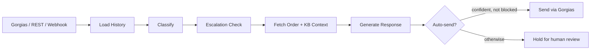

<div align="center">

# cs-agent

**An AI customer support agent for Shopify + Gorgias — reads full ticket threads, looks up real order data, drafts grounded replies, and only auto-sends when it's confident.**

[](https://www.python.org/)
[](https://fastapi.tiangolo.com/)
[](https://langchain-ai.github.io/langgraph/)
[](tests/)

[Overview](#overview) •
[Architecture](#architecture) •
[Getting started](#getting-started) •
[Configuration](#configuration) •
[API](#api) •
[Deployment](#deployment) •
[Project layout](#project-layout)

</div>

## Overview

Most of a Shopify support inbox is the same handful of questions: where's my order, can I return this, when does it ship. `cs-agent` is a FastAPI + LangGraph service that sits between your Gorgias helpdesk and your Shopify store, and handles that volume automatically:

- Loads the **full conversation thread** for a ticket, not just the latest message, before classifying or replying.
- Looks up **real order data** from the Shopify Admin API when a ticket is order-related.
- Grounds replies in a **RAG knowledge base** built from your store's policies, product catalog, and custom FAQ content, embedded and searched locally in SQLite.
- Escalates automatically after repeated follow-ups, and never auto-sends refund, complaint, or legal-adjacent replies regardless of confidence.
- Drafts refunds and order resends for a human to approve — it never executes a money-moving action on its own.
- Logs every LLM call (input, output, latency, tokens, cost) so any reply can be traced back to exactly what the model saw.

> [!IMPORTANT]
> One deployed instance serves exactly one Shopify store. `TENANT_NAME` is a deployment label, not a row-level filter — deploying a second client means deploying a second instance with its own `.env` and database.

A React + Tailwind dashboard (in [`dashboard/`](dashboard/)) is included for reviewing tickets, approving refunds, and watching cost and confidence calibration over time.

## Architecture

Each ticket runs through a LangGraph pipeline: load thread history, classify (category, priority, sentiment), check for escalation, conditionally fetch Shopify order data and knowledge-base context, generate a response, then decide whether to auto-send or hold it for review.



Three inbound paths feed the same pipeline: Gorgias webhooks (ticket-created, message-created), a generic `/webhooks/inbound` endpoint for other channels (WhatsApp, chat widgets), and a direct REST API for custom integrations. All three share the same thread memory, so a ticket started on one channel behaves consistently regardless of where the next message comes from.

LLM calls go through a provider chain — Groq first, then OpenRouter or Gemini, falling back to Claude Haiku on an outage — configured in [`agent/llm.py`](agent/llm.py).

## Getting started

**Requirements:** Python 3.12+, an LLM provider key (Groq recommended), and — for order lookups and ticket sync — Shopify and Gorgias credentials.

```bash
git clone https://github.com/Ismail-2001/customer-support-ai-employee.git
cd customer-support-ai-employee
pip install -r requirements.txt
cp .env.example .env   # then fill in TENANT_NAME, GROQ_API_KEY, etc.
uvicorn api.main:app --reload --port 8001
```

Confirm it's up:

```bash
curl http://localhost:8001/health
```

> [!TIP]
> Leave `AUTO_SEND_ENABLED=false` for the first deployment. Every reply becomes a draft in Gorgias for a human to approve, which is the fastest way to build trust in the agent's judgment before letting it send on its own.

### Docker

```bash
docker compose up -d
```

### Dashboard

```bash
cd dashboard
npm install
npm run dev
```

Opens at `http://localhost:5173` and asks for your API's base URL and `API_KEY` on first load — see [`dashboard/README.md`](dashboard/README.md) for details.

### Tests and evals

```bash
pytest tests/ -v            # 104 unit/integration tests
python -m evals.run_evals   # golden-dataset accuracy + prompt-injection resistance
```

## Configuration

All settings are read once, centrally, in [`agent/config.py`](agent/config.py). The full list with explanations lives in [`.env.example`](.env.example); the ones you'll actually need to touch:

| Variable | Required | Purpose |
|---|---|---|
| `TENANT_NAME` | Yes | Deployment label for this client — also namespaces the SQLite DB file |
| `GROQ_API_KEY` | Yes* | Primary LLM provider (or set `OPENROUTER_API_KEY` instead) |
| `ANTHROPIC_API_KEY` | No | Fallback model, used automatically if the primary provider errors |
| `SHOPIFY_SHOP_DOMAIN` / `SHOPIFY_ACCESS_TOKEN` | For order lookups | Shopify Admin API, `read_orders` scope |
| `GORGIAS_DOMAIN` / `GORGIAS_EMAIL` / `GORGIAS_API_KEY` | For ticket sync | Gorgias REST API |
| `API_KEY` | Yes | Required on every `/support/*` endpoint except webhooks |
| `AUTO_SEND_ENABLED` | No | Defaults `false` — replies stay as drafts until you flip this |
| `AUTO_SEND_MIN_CONFIDENCE` | No | Confidence threshold below which a draft is held (default `0.85`) |
| `AUTO_SEND_BLOCKED_CATEGORIES` | No | Categories that never auto-send regardless of confidence (default `refund,complaint,legal,other`) |
| `DAILY_COST_CAP_USD` | No | Force-disables auto-send for the rest of the day once crossed (default `5.0`) |

> [!NOTE]
> Webhook endpoints (`/webhooks/*`) authenticate with their own shared secrets (`GORGIAS_WEBHOOK_SECRET`, `INBOUND_WEBHOOK_SECRET`) instead of `API_KEY`, since most webhook senders can't be configured with a custom header.

## API

Full interactive docs are served at `/docs` once the app is running. Key endpoints:

| Endpoint | Purpose |
|---|---|
| `POST /support/tickets` | Create a ticket directly via REST |
| `GET /support/tickets/{id}` | Fetch a ticket and its thread |
| `POST /support/tickets/{id}/respond` | Generate (and optionally send) a reply |
| `POST /support/tickets/{id}/actions/refund` | Approve a suggested refund — requires an `Idempotency-Key` header |
| `POST /support/tickets/{id}/actions/resend-order` | Approve a suggested resend |
| `POST /support/knowledge-base/sync-shopify` | Sync policies + product catalog into the RAG index |
| `GET /support/analytics/quality` | Edit-rate by category — the AI-draft-vs-human-sent diff |
| `GET /support/tickets/{id}/trace` | Full pipeline trace for a given reply |
| `POST /webhooks/gorgias/ticket-created` | Gorgias webhook — new ticket |
| `POST /webhooks/gorgias/message-created` | Gorgias webhook — new message on existing ticket |

A read-only [MCP server](mcp_server/) is also included, exposing order lookup, knowledge-base search, and ticket retrieval as tools for Claude Desktop or Claude Code — see [`mcp_server/README.md`](mcp_server/README.md).

## Deployment

**Render (Blueprint):** push to GitHub, then in Render go to New → Blueprint and point it at this repo. `render.yaml` defines the service; fill in the `sync: false` variables (API keys, secrets) in the dashboard.

```bash
curl https://your-instance.onrender.com/health
./scripts/smoke_test.sh https://your-instance.onrender.com YOUR_API_KEY
curl -X POST https://your-instance.onrender.com/support/knowledge-base/sync-shopify \
  -H "X-API-Key: YOUR_API_KEY"
```

> [!WARNING]
> On Render's free tier, SQLite lives on ephemeral disk — every deploy wipes ticket history. Fine for evaluation; upgrade to a paid plan with an attached disk once you need data to persist.

**Docker:** `docker compose up -d` builds and runs the service from the included `Dockerfile`.

See [`DEPLOYMENT_CHECKLIST.md`](DEPLOYMENT_CHECKLIST.md) for the full pre- and post-deploy checklist.

## Project layout

```
agent/          Core pipeline — classifier, LangGraph graph, storage, LLM routing, config
api/            FastAPI app and route handlers
integrations/   Shopify and Gorgias API clients
mcp_server/     Read-only MCP server for Claude Desktop / Claude Code
dashboard/      React + Tailwind operator console (separate static deploy)
evals/          Golden-dataset evaluation harness and versioned results
tests/          104 unit and integration tests
scripts/        Post-deploy smoke test, env/config sync checker
```

## Contact

**Ismail Sajid** — [github.com/Ismail-2001](https://github.com/Ismail-2001)

Questions about deployment, custom integrations, or licensing — open an [issue](https://github.com/Ismail-2001/customer-support-ai-employee/issues).
